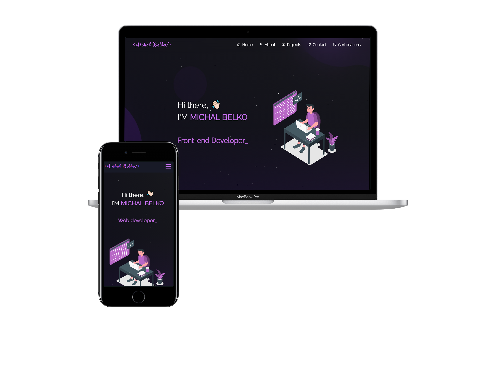

<h2 align="center">
  Portfolio Website
</h2>

  

My personal portfolio <a href="https://michalbelko.github.io/Portfolio" target="_blank">Michal Belko | Portfolio</a> which features some of my github projects as well as my resume , technical skills and certifications. 

## Built With 🛠️

This project was built using these technologies:

- Vue.js
- Vite
- Node.js
- Bootstrap
- CSS3
- Jquery
- ParticlesJS

 ## Features 🔧

**📖 Multi-Page Layout**

**🎨 Styled with Vue-Bootstrap and Css with easy to customize colors**

**📱 Fully Responsive**
